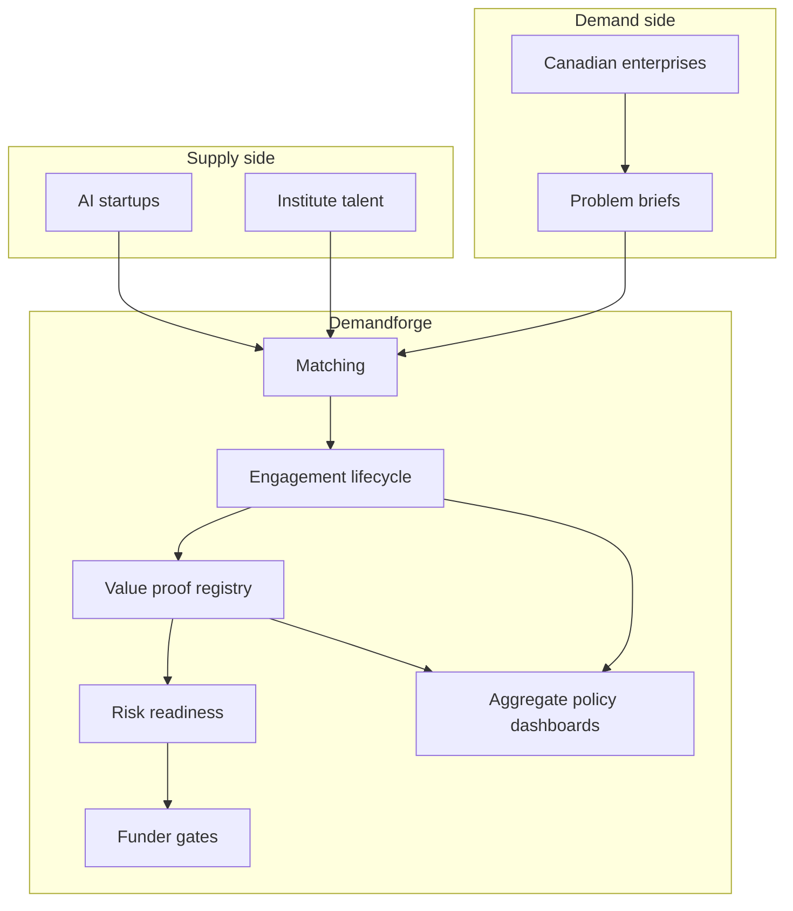

# Demandforge

**Source:** `ai-in-gov/omnia_canada_ai_imperative/`
**Domain:** `ai-gov`
**One-liner:** A domestic AI demand forge that turns Canadian enterprise problems into funded, value-proven engagements for startups and talent — so research strength stops exporting abroad and adoption moves past perpetual pilots.
**Wedge:** Mid-market and enterprise Canadian firms that have experimented with AI but stuck under five initiatives and under $5M spend — matched to the ~650 AI startups and institute-linked talent in Toronto, Montreal, Edmonton and Vancouver who cannot find enough sophisticated domestic buyers.
**Positioning:** Talent-ecosystem demand infrastructure. Pan-Canadian strategy doubles down on research supply; Demandforge treats *paid domestic problem flow* as the scarce resource that keeps talent, scales startups past the sales/marketing gap, and gives policymakers a live map of adoption barriers (trust, skills, data, supplier discovery).

## Market research synthesis

### Thesis from source

Deloitte’s “Canada’s AI imperative: From predictions to prosperity” (Omnia / Deloitte series opener) argues that AI is among the leading economic drivers of the era — citing worldwide AI spending toward US$78 billion by 2022 and business value of US$3.9 trillion — and that Canada’s early research and talent lead is “precarious.” The paper’s distinctive claim is that leadership requires balanced *supply and demand*, and that Canada’s main failure mode is demand: policy and investment have doubled down on research and talent (CIFAR’s $125 million Pan-Canadian AI Strategy with AMII, MILA and Vector; nodes in Edmonton, Montreal, Toronto; goals to grow researchers, thought leadership and a national research community) while businesses under-invest and stall in experimentation.

Survey evidence is concrete. Only 16% of Canadian businesses reported using AI in the past year — unchanged since 2014. Among early adopters: 67% spent less than $5 million in FY2017–18; 59% deployed fewer than five ai-related initiatives; only 8% planned to increase spending more than 20% (40% fewer than the global average); only 31% said AI would be critically important to near-term success; 81% reported significant risk concerns and 64% said they were not fully prepared to deal with them. Four barriers structure the product: (1) understanding — only 4% of Canadians were confident explaining AI, while 86% said they do not use ai-powered tools despite ubiquitous smartphones; (2) trust — top organisational risks were wrong strategic decisions from AI recommendations (47%), cybersecurity (44%) and unclear legal responsibility (40%); ethical worries included manipulation/falsehoods, unintended consequences and lack of explanation/audit trail, with Canadians more concerned than global peers, and only ~1 in 10 believing government or business is well prepared despite ~7 in 10 assigning them responsibility; (3) market discovery — 68% of early adopters had low-to-modest familiarity selecting AI technologies/suppliers, while suppliers ranked proving business value as their top challenge (41%), alongside partner issues and finding the right use case (33% each), consistent with Lazaridis Institute findings on sales, marketing, product and business-development talent gaps; (4) scale — integration into roles/functions (40%), implementation (39%) and data issues (39%) block production deployment, with few firms running company-wide transformational initiatives.

The strategic warning is migration physics: “Top talent will go to the parts of the world with the most advanced problems and the companies willing to pay to solve those problems.” Without domestic demand, Canada feeds other countries’ growth. First-mover data network effects and US/China standard-setting raise the stakes for a small open economy that wants human-centric, collaborative norms rather than data hoarding. Public policy must go further than research grants — safety guidelines (61% of citizens), new laws (58%), and free training for displaced workers (48%) — while clarifying privacy, legal responsibility and inclusion obligations so firms will invest. The paper calls for an AI prosperity strategy unifying business and policymakers; Demandforge is the operational wedge of that strategy on the demand side: problem briefs, matched supply, value proof, risk readiness and talent retention signals in one loop.

### Buyer & economic model

- **Primary buyer:** federal or provincial economic-development / innovation ministry programme owners co-funding domestic AI adoption, jointly with industry consortia (banks, energy, telecom, media, health) that need a managed pipeline of problems and suppliers.
- **Users:** enterprise AI product owners and COOs (weekly), startup BD and delivery leads (daily), institute talent/placement officers (weekly), procurement and legal/risk (per engagement), policymakers watching adoption KPIs (monthly), workforce/reskilling programme managers (per cohort).
- **Budget owner / value metric:** innovation and industrial-strategy envelopes plus enterprise AI OpEx. The value metric is number of engagements that exit pilot into production with a signed value proof, and net retention of startup employees / researchers in Canada attributable to domestic deal flow. Secondary metrics are median time from problem brief to matched supplier and share of early adopters increasing spend year-over-year.
- **Competing status quo:** CIFAR/institute demos, accelerator demo-days, Big Tech lab brand awareness, and consulting pilots that never integrate into roles — with no shared ledger of which problems are funded, which value claims were proven, and which risk controls were satisfied.

### Domain constraints

- **Regulatory / trust / safety:** privacy law uncertainty (GDPR-like vs permissive models), legal responsibility for black-box decisions, bias/inclusion obligations, cybersecurity of AI systems; citizen expectation that government sets safety guidelines and supports displaced workers.
- **Data sensitivity:** enterprise problem briefs may contain competitive information; matching must avoid leaking data between rival firms; talent profiles and immigration status need careful handling.
- **Change-management realities:** firms misread AI as only for Google-scale players; suppliers lack commercialisation talent; public research funding culture resists being scored on domestic demand outcomes. The product must make value proof and risk readiness cheaper than another unaudited pilot.

## Business requirements

- BR-1: Every funded engagement must start from a structured problem brief owned by a Canadian buyer, not from a technology looking for a home.
- BR-2: Matching must consider supplier capability, domain fit and commercialisation readiness (sales/product capacity), not research prestige alone.
- BR-3: A pilot cannot be marked successful without a recorded value proof against pre-agreed metrics (the supplier’s #1 pain).
- BR-4: Risk-readiness checks — decision liability, cybersecurity, explanation/audit trail, bias — must be completed before production scale endorsement.
- BR-5: The platform must track whether an engagement integrates into roles and functions, not only whether software was installed.
- BR-6: Talent attached to engagements (hires, co-ops, institute placements) must be countable so brain-drain counterfactuals are evidence-based.
- BR-7: Buyer literacy modules must be optional gates for organisations below a confidence threshold, addressing the 4% explanation problem without blocking experts.
- BR-8: Supplier discovery must reduce low familiarity with selecting AI vendors by exposing comparable past value proofs in-sector.
- BR-9: Policymakers must receive aggregated adoption, barrier and reskilling-demand indicators without seeing confidential enterprise data.
- BR-10: Cross-border data and IP terms must be explicit so open-economy collaboration does not default to data hoarding or silent IP flight.
- BR-11: Public co-funding drawdowns must be conditional on problem-brief quality, value-proof posting and risk-readiness, not on slideware milestones.
- BR-12: Success is increased domestic AI spend progressing past experimentation and measurable retention of AI talent in Canadian entities year over year.

## User stories

Canonical user stories live in sibling [USER_STORIES.md](USER_STORIES.md).

## System design

### Overview

Demandforge is a two-sided operating system: buyers post problem briefs; suppliers and talent are matched; engagements progress through pilot → value proof → risk readiness → production integration; talent attachments and spend changes are recorded; funders and policymakers consume aggregates. It does not replace CIFAR research funding; it creates the missing demand ledger that makes supply sticky in Canada.

### Actors & boundaries

- **Actors:** enterprise buyers, AI startups/suppliers, institute talent, public funders, regulators/policy analysts, workers entering reskilling pathways.
- **Trust boundary:** problem-brief confidentiality between rival buyers; personal talent data minimised; policymaker views are aggregate; value proofs may be published in redacted form for discovery.
- **Human-in-the-loop points:** match acceptance, value-proof verification, production-scale endorsement, public funding release, dispute on failed pilots.

### Core capabilities

1. **Problem brief studio** (literacy-assisted).
2. **Supplier and talent profiles with commercialisation readiness**.
3. **Matching and shortlist**.
4. **Engagement lifecycle** (pilot → production).
5. **Value-proof registry**.
6. **Risk-readiness checklist** (liability, cyber, explainability, bias).
7. **Role-integration tracking**.
8. **Talent attachment and retention signals**.
9. **Funder gate and drawdown**.
10. **Policy aggregate dashboards**.

### Conceptual data

- **Primary entities:** Organisation, ProblemBrief, SupplierProfile, TalentProfile, Match, Engagement, ValueProof, RiskReadiness, RoleIntegration, FundingGate, BarrierSignal, RetentionSnapshot.
- **Critical events:** brief published, match proposed/accepted, pilot started, value proof posted/verified, risk readiness passed/failed, production endorsed, funding released, talent attached/departed.
- **Retention / audit needs:** value proofs and funding decisions retained for programme audit windows; confidential briefs retained per buyer contract; personal talent data deleted on schedule.

### Integrations (conceptual)

- **Systems of record:** enterprise procurement and ITSM, startup CRM, institute HR/placement, grant management systems, privacy impact tools.
- **Upstream signals:** CIFAR/node talent directories, open job markets, sector consortia challenge statements, citizen literacy campaigns.
- **Downstream actions:** contract awards, funding disbursements, public adoption statistics, reskilling programme enrolment triggers.

### High-level architecture

### Success metrics

- **Leading:** briefs posted per quarter; match-to-accept rate; value proofs verified per 100 pilots; risk-readiness pass rate before scale; talent attachments on domestic engagements.
- **Lagging:** share of early adopters increasing AI spend >20%; reduction in sub-five-initiative stagnation; startup and researcher net retention in Canada; citizen/business preparedness perception lift on safeguard coverage.

## OpenAPI skeleton

Canonical HTTP surface lives in sibling [openapi.yaml](openapi.yaml). Summary:

- **Base path:** `/v1/...`
- **Auth:** `X-API-Key` for partner systems; Bearer JWT for buyer, supplier and funder operators.
- **Resource groups:** ProblemBriefs, Suppliers, Matches, Engagements, ValueProofs, RiskReadiness, Reporting.
