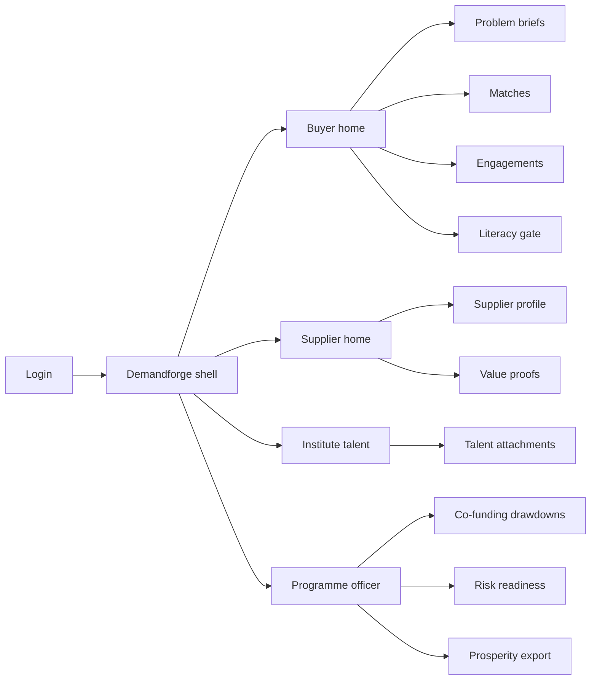
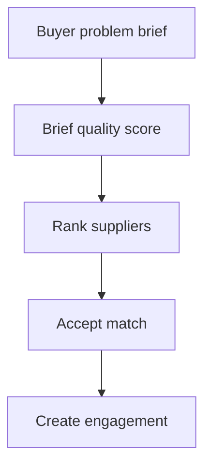
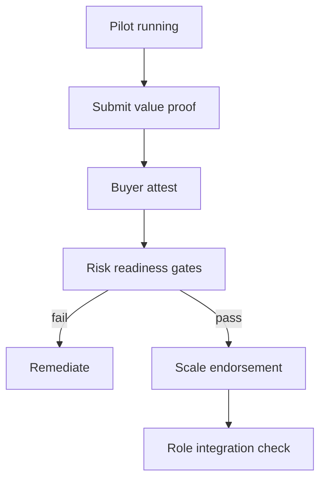

# Demandforge — Web app

**Product:** [PRODUCT.md](./PRODUCT.md)
**Primary surface:** Domestic AI demand forge console (buyer, supplier, institute, and programme-officer workspaces under one Demandforge shell)
**Secondary surfaces:** Policymaker prosperity dashboard (aggregated, no enterprise confidentials); public value-proof gallery (sanitised in-sector comps)
**Design thesis:** Demandforge is a forge for paid Canadian problems — not another institute demo day and not a grant portal that scores slideware. The metaphor is a foundry ticket: problem brief in, matched commercialisation-ready supplier, value proof stamped before “success,” risk gates before scale, talent counted so brain-drain claims become evidence. Visual language is cold lake-blue and forge-ember orange on graphite (northern industrial, not purple AI, not maple-cliché red flood). The Demandforge wordmark sits as a quiet mint on every engagement and co-funding screen — the demand-side twin of research supply.

## UX research synthesis

### Category peers (best-in-class)

- **IRAP / NRC industrial assistance portals:** Structured project briefs and milestone-tied public funding. Steal: drawdowns conditional on evidence; reject tech-push RFPs that start from a model looking for a home.
- **Challenge.gov / Canadian Innovative Solutions Canada patterns:** Problem-owned challenges matched to suppliers. Steal: buyer-owned problem statements; reject prize-only framing without production integration tracking.
- **Enterprise vendor management (e.g. Coupa / Ariba lite patterns for services):** Comparable past performance and commercial readiness. Steal: supplier scorecards beyond research prestige; reject pure price auction for AI pilots.
- **Vector / MILA / Amii community portals (as anti-pattern peers):** Strong supply signalling, weak paid-demand ledger. Steal: institute talent attachment hooks; reject demo-day as the definition of adoption success.

### Patterns to adopt / reject

- **Adopt:** Problem-brief-first funding; match on domain + commercialisation readiness; value-proof required to exit pilot; risk-readiness gates (liability, cyber, audit trail, bias); role/function integration tracking; talent counters; optional literacy gates; sanitised in-sector comps; aggregated policymaker export; explicit cross-border IP/data terms; co-funding drawdowns on proof not slides.
- **Reject:** Perpetual pilot badges as success; research-prestige-only match; Big Tech brand as trust proxy; purple “AI insights”; dashboard that celebrates initiative count without spend progression.

### Trust, density, and workflow constraints from PRODUCT.md

Competitive briefs must not leak between rival firms (domain constraint). Policymakers see aggregates only (BR-9). Citizens expect government safety guidelines — risk gates before scale (BR-4). Public money cannot clear on slideware (BR-11). Success = spend past experimentation + talent retained in Canadian entities (BR-12).

## Information architecture

### Nav model

### Roles → default home

| Role | Default home | Why |
|------|--------------|-----|
| Enterprise AI / COO | Buyer home — briefs under five initiatives | Stuck-adopter wedge (BR-1) |
| Startup BD / delivery | Supplier home — open matches | Commercialisation gap (BR-2) |
| Institute placement officer | Talent attachments | Retention evidence (BR-6) |
| Procurement / legal-risk | Risk readiness gates | Before scale endorsement (BR-4) |
| Programme officer (fed/prov) | Co-funding drawdowns | Conditional public money (BR-11) |
| Policymaker | Prosperity export | Aggregates only (BR-9, BR-12) |

### Cross-links to OpenAPI resources

| Nav area | OpenAPI tags / resources |
|----------|---------------------------|
| Problem briefs | ProblemBriefs |
| Supplier profiles | Suppliers |
| Matching | Matches |
| Engagement lifecycle | Engagements |
| Value proofs | ValueProofs |
| Risk readiness gates | RiskReadiness |
| Prosperity / adoption export | Reporting |

## Screen inventory

### Buyer home

- **Purpose:** Answer “which of my funded problems are still pilots, and which have stamped value proofs and risk clearance?”
- **Entry:** Enterprise login default.
- **Layout regions:** Brand + org; initiative/spend strip (<5 / <$5M context); brief pipeline; match recommendations; blocked scale banners.
- **Primary actions:** New brief; open match; post value proof; start literacy if gated.
- **Empty / loading / error:** Empty = structured brief wizard (not “browse startups”).
- **BR / story ties:** BR-1, BR-3, BR-7.

### Problem brief editor

- **Purpose:** Buyer-owned structured problem with pre-agreed success metrics and confidentiality scope.
- **Entry:** Buyer CTA; programme quality gate.
- **Layout regions:** Problem narrative; metrics; data/IP boundary; cross-border terms; quality score for co-funding eligibility.
- **Primary actions:** Save; submit for match; request co-funding.
- **Empty / loading / error:** Low quality score blocks public drawdown (BR-11).
- **BR / story ties:** BR-1, BR-10, BR-11.

### Supplier profile and discovery

- **Purpose:** Capability, domain fit, commercialisation readiness — not prestige alone; comps from past value proofs.
- **Entry:** Supplier home; buyer match browse.
- **Layout regions:** Capability tags; sales/delivery capacity; in-sector sanitised proofs; institute links.
- **Primary actions:** Update profile; express interest; view comps.
- **Empty / loading / error:** Empty proofs = “no verified domestic value proofs yet”.
- **BR / story ties:** BR-2, BR-8.

### Match workspace

- **Purpose:** Propose and accept matches scored on domain + commercialisation readiness.
- **Entry:** From brief; supplier inbox.
- **Layout regions:** Ranked suppliers; score breakdown; conflict-of-interest / rival-leak warnings; accept/decline.
- **Primary actions:** Accept match; request alternate; create engagement.
- **Empty / loading / error:** No fit = widen domain or improve brief metrics.
- **BR / story ties:** BR-2.

### Engagement lifecycle

- **Purpose:** Advance pilot → value-proven → risk-cleared → role-integrated production — explicit stages.
- **Entry:** After match; buyer/supplier shared object.
- **Layout regions:** Stage rail; advance controls; integration checklist (roles/functions); talent attachment panel; IP/data terms summary.
- **Primary actions:** Advance stage; attach talent; open risk gate; post proof.
- **Empty / loading / error:** Advance to success blocked without value proof.
- **BR / story ties:** BR-3, BR-5, BR-6, BR-10.

### Value proof desk

- **Purpose:** Record proof against pre-agreed metrics; supplier’s #1 pain made mandatory.
- **Entry:** Engagement; public gallery (sanitised).
- **Layout regions:** Metric table; evidence attachments; buyer attestation; sanitisation preview for gallery.
- **Primary actions:** Submit proof; attest; publish sanitised comp.
- **Empty / loading / error:** Missing metrics from brief = cannot submit.
- **BR / story ties:** BR-3, BR-8.

### Risk readiness gates

- **Purpose:** Decision liability, cybersecurity, explanation/audit trail, bias — before production scale endorsement.
- **Entry:** Engagement advance to scale; legal/risk role.
- **Layout regions:** Gate checklist; pass/fail stamps; remediation tasks; endorsement lock.
- **Primary actions:** Pass/fail gate; endorse scale; revoke.
- **Empty / loading / error:** Any open fail blocks scale endorsement.
- **BR / story ties:** BR-4.

### Talent attachment and retention

- **Purpose:** Count hires, co-ops, institute placements on engagements for brain-drain evidence.
- **Entry:** Institute home; engagement panel.
- **Layout regions:** Attachment list; Canadian entity flag; cohort retention export (aggregate).
- **Primary actions:** Attach person/role; close placement; export counts.
- **Empty / loading / error:** Empty = prompt institute match.
- **BR / story ties:** BR-6, BR-12.

### Literacy gate (optional)

- **Purpose:** Optional modules for orgs below confidence threshold without blocking experts.
- **Entry:** Buyer home when threshold fails; skip for experts.
- **Layout regions:** Module list; confidence self-check; completion unlock for co-funding tier.
- **Primary actions:** Complete module; skip with attested expertise.
- **Empty / loading / error:** N/A.
- **BR / story ties:** BR-7.

### Co-funding drawdowns

- **Purpose:** Public money releases only when brief quality, value proof, and risk readiness exist.
- **Entry:** Programme officer home.
- **Layout regions:** Eligible engagements; condition checklist; drawdown history; slideware rejection log.
- **Primary actions:** Approve drawdown; reject with reason; audit trail.
- **Empty / loading / error:** Conditions unmet = disabled approve.
- **BR / story ties:** BR-11.

### Prosperity export (policymaker)

- **Purpose:** Aggregated adoption, barriers, reskilling demand, talent retention — no confidential briefs.
- **Entry:** Policymaker secondary; Reporting API consumer UI.
- **Layout regions:** KPI tiles; barrier mix; spend-progression cohorts; talent retention trend; export.
- **Primary actions:** Export period pack; drill aggregates only.
- **Empty / loading / error:** Sparse data honesty banner.
- **BR / story ties:** BR-9, BR-12.

## Key flows

1. **Brief to match to engagement** — structured brief → quality score → match on capability/commercialisation → accept; failure: tech-push listing without buyer brief rejected for funding.

2. **Pilot exit with value proof** — pre-agreed metrics → evidence → buyer attest → stage advance; failure: no proof = cannot mark successful.

3. **Co-funding drawdown** — conditions check → approve/reject → ledger.

4. **Talent retention signal** — attach placements → aggregate export for policy.

5. **Supplier discovery via comps** — browse sanitised in-sector value proofs → request match.

## Design system

### Tokens (CSS variables)

- `--color-ink: #E6EEF2` — text on dark
- `--color-graphite: #12181F` — ground
- `--color-panel: #1A222C` — panels
- `--color-lake: #3A7CA5` — primary actions / Canada north without flag red flood
- `--color-ember: #D97706` — forge attention / pilot heat
- `--color-proof: #2F9B7A` — value proof stamped
- `--color-coral: #D94F45` — risk fail / drawdown reject
- `--color-steel: #8B98A5` — secondary
- `--color-brand: #5BA4C9` — Demandforge mark
- `--font-display: "Geist", sans-serif` — modern industrial display (not Inter as hero; Geist or similar distinctive)
- `--font-body: "IBM Plex Sans", sans-serif`
- `--font-mono: "IBM Plex Mono", monospace` — engagement ids, proof hashes
- `--space-1`…`--space-8`: 4px scale
- `--radius-sm: 4px`; `--radius-md: 8px`
- `--motion-stamp: 170ms ease-out` — value-proof stamp
- `--motion-advance: 220ms ease-in-out` — stage rail advance
- `--motion-gate: 180ms ease-out` — risk gate flash
- Atmosphere: soft ember radial behind engagement stage rail; subtle topographic noise (shield, not maple leaf wallpaper); no stock handshake heroes.

### Typography & brand

- Display for stage titles and proof numerals; mono for ids.
- Brand on engagement, drawdown, and prosperity screens.
- Login: brand hero; headline (“Fund the problem. Stamp the proof.”); one CTA.

### Do / don’t

- **Do:** Start from briefs; require value proof; gate scale on risk; count talent; aggregate for policy; condition public money.
- **Don’t:** Demo-day home; prestige-only match; success without proof; purple AI; leak rival briefs; celebrate initiative count alone.

### Accessibility & domain trust cues

- Ember/coral with text labels for stages and fails.
- Live regions for gate failures and drawdown decisions.
- Focus: brief → match → proof → risk → drawdown.
- Confidential fields never appear in policymaker export previews.

## Component patterns

- **ProblemBriefForm** — structured metrics + confidentiality scope.
- **CommercialisationScore** — sales/delivery readiness beside domain fit.
- **MatchRankList** — explainable match factors.
- **EngagementStageRail** — pilot → proof → risk → integrated.
- **ValueProofStamp** — attested metrics panel.
- **RiskGateChecklist** — liability/cyber/audit/bias.
- **TalentAttachmentRow** — hire/co-op/placement countable.
- **LiteracyOptionalGate** — skip-with-attest path.
- **CofundConditionChecklist** — drawdown enablement.
- **ProsperityAggregateExport** — no confidential drill-through.

## Out of scope for v1 web

- Replacing CIFAR grant administration; immigration casework; full procurement e-bidding replacement; cross-border data escrow hosting; consumer AI literacy social app; US/China marketplaces.
